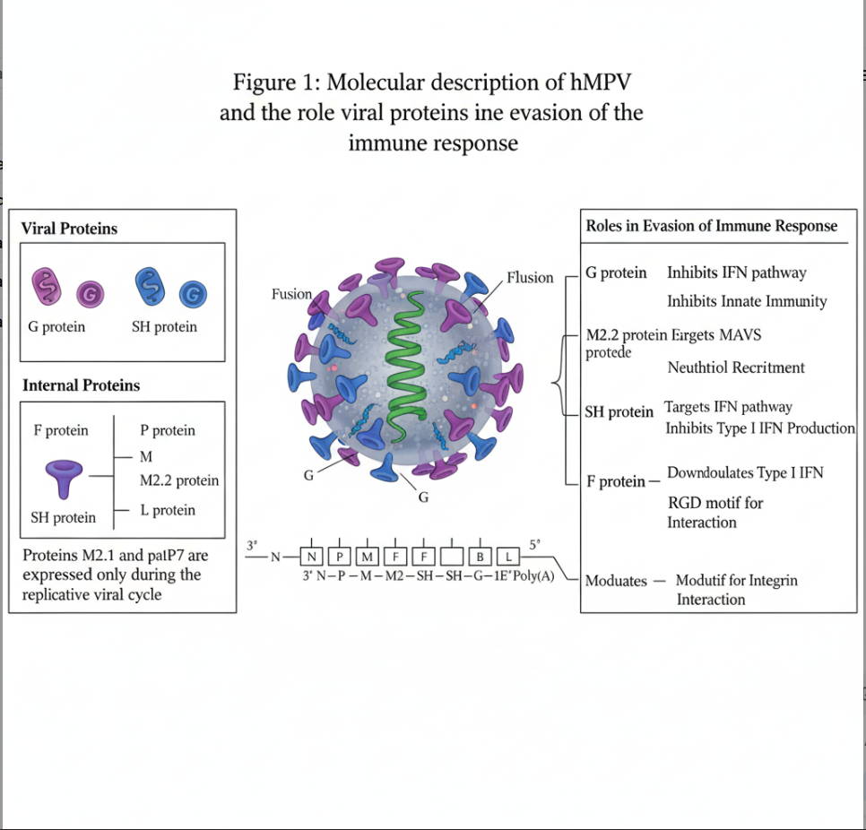

# HMPV-Virus

# 🦠 Human Metapneumovirus (HMPV): AI-Powered Diagnosis & Immune Evasion

- 🚨 **Overview:**  
Human metapneumovirus (HMPV) is a leading cause of upper and lower respiratory tract infections. It poses a serious threat to children, the elderly, and immunocompromised individuals.

- 🧑‍⚕️ **Clinical Importance:**
The clinical severity escalates with comorbidities such as advanced age, chronic lung disease, cardiovascular issues, and weakened immunity. Early detection and risk stratification are essential for effective management.

- 🌍 **Epidemiology:**  
  HMPV is prevalent worldwide, with fluctuations in incidence and seasonal outbreaks. Regional studies show it can account for up to 10% of hospital admissions for acute respiratory illness.

- 🔬 **Immune Evasion:**  
  HMPV uses viral proteins (G, SH, M2.2, F) to evade host immune responses by inhibiting interferon pathways and sabotaging innate immunity. This enables viral persistence and increases disease burden.

- 🤖 **AI-Enabled Diagnostics:**  
  Novel deep learning pipelines utilize MobileNetV2, ResNet-50, UNet, and LSTM architectures. They achieve high accuracy by enhancing lung image segmentation, temporal progression modeling, and virus classification.

- 🗂️ **Data Methodology:**  
  The imaging dataset is split into train, test, and validation sets. Preprocessing includes resizing, normalization, and augmentation, ensuring robust and unbiased model evaluation.

- 🏥 **Clinical Implementation:**  
  AI-powered diagnostics support real-time clinical decision-making. Models show >95% accuracy and facilitate the early identification of HMPV and related comorbidities such as pneumonia and ARDS.

- 🧠 **Multimodal Integration:**  
  Future pipelines aim to integrate clinical notes, lab results, and imaging data using attention mechanisms. This will enable holistic patient assessment and personalized management strategies.

- 🚀 **Deployment & Future Directions:**  
  Efficient deployment at the point of care is becoming possible with edge devices and federated learning. Continued validation and global multi-center studies are critical for improving outcomes.

## 🦠 Virus Architecture & Protein Function

- 
  *Molecular description of human metapneumovirus (hMPV) and the role viral proteins play in evasion of the immune response.*

- 🌟 **Viral Proteins Overview:**  
  - **G protein (purple):** Inhibits the host interferon (IFN) pathway and innate immunity, helping the virus hide from early immune defenses.
  - **SH protein (blue):** Targets the IFN pathway and inhibits the production of Type I IFN, further weakening the body's immediate viral response.

- 🏛️ **Internal Proteins:**  
  - **F protein:** Enables fusion between the viral and host cell membranes, downregulates Type I IFN, and contains an RGD motif for integrin interaction, which assists entry and modulates immune activity.
  - **P, M, M2.2, L proteins:** Vital for viral replication and RNA synthesis within infected cells.
  - Certain proteins (M2.1 and palP7) are expressed only during the active replicative cycle.

- 📜 **Genome Organization:**  
  - The linear RNA genome encodes these proteins in specific sequence order:  
    `3′ N—P—M—F—M2—SH—G—L 5′`

- 🔒 **Immune Evasion Functions:**  
  - **G protein:** Blocks both IFN and general innate pathways.
  - **M2.2 protein:** Targets MAVS to interfere with antiviral signaling; recruits neutrophils.
  - **SH protein:** Halts host antiviral responses.
  - **F protein:** Interacts via RGD motif with host cell integrins, facilitating infection and modulating immunity.

## 📚 References

- [Human metapneumovirus infection and comorbid conditions]
- [Epidemiology and molecular detection surveys]
- [Deep learning chest imaging models for virus classification]
- [Hybrid model innovation (UNet, LSTM) for temporal modeling]
- [Clinical validation: Diagnostic accuracy]
- [Multimodal attention and data integration]
- [Generalizability and cohort study limitations]
- [Edge deployment and point-of-care studies]
- [Future directions in clinical informatics and predictive diagnostics]
- [NCBI – Human Metapneumovirus]

- Read the full article: [HMPV Virus on Medium](https://medium.com/@saivimenthanvl/hmpv-virus-177aad08d84a)
